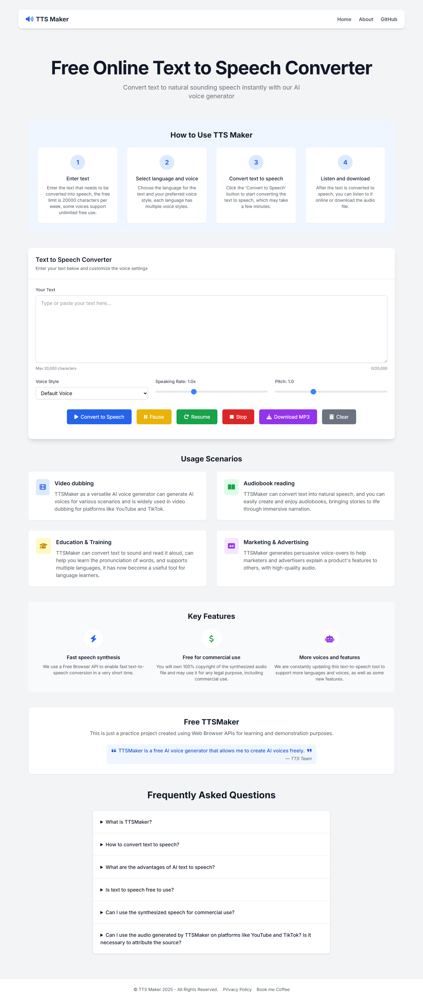

# 🎤 TTS Maker Clone


## 📝 Description

**TTS Maker Clone** is a professional-grade text-to-speech web application built with **Node.js**, **Express**, and **EJS** templates. This project mimics the functionality of popular TTS services with a clean, modern UI and comprehensive features.

### 🔑 Key Features

- 🎤 Browser-based text-to-speech using Web Speech API  
- 🌍 Multiple voice and language support  
- ⚡ Adjustable speech rate and pitch  
- 📥 Audio download capability  
- 📱 Fully responsive design  
- 🎨 Professional UI with Tailwind CSS

## 📸 Preview



## 🛠️ Technologies Used

### Frontend

- HTML5, CSS3, JavaScript  
- Tailwind CSS (CDN) for styling  
- Font Awesome for icons  
- Web Speech API for TTS functionality

### Backend

- Node.js  
- Express.js  
- EJS templating engine

## 📦 Installation

Follow these steps to set up the project locally:

```bash
# Clone the repository
git clone https://github.com/sheix-khizar/Text-to-Speech-Web-App.git
cd tts-maker-clone

# Install dependencies
npm install
```

### Create a `.env` file:

```
PORT=3000
```

### Start the development server:

```bash
node app.js
```

Visit the app in your browser at:

```
http://localhost:3000
```

## 🎨 Project Structure

```
tts-maker-clone/
├── public/               # Static files
│   ├── script.js         # Frontend JavaScript
│   └── styles.css        # Additional CSS
├── views/                # EJS templates
│   ├── partials/         # Reusable components
│   │   ├── header.ejs    # Header template
│   │   └── footer.ejs    # Footer template
│   └── index.ejs         # Main view
├── app.js                # Express application
├── package.json          # Project dependencies
├── .env                  # Environment variables
└── README.md             # Project documentation
```

## 🌟 Features

### Core Functionality

- Text-to-speech conversion using Web Speech API  
- Voice selection from available system voices  
- Adjustable speech rate (0.5x to 2x)  
- Adjustable pitch (0.5 to 2)  
- Play, pause, resume, and stop controls  

### UI/UX Highlights

- Character counter with limit indicator  
- Visual feedback for actions  
- Progress bar for audio playback  
- Fully responsive for mobile, tablet, and desktop  
- Accessible and intuitive design

### Additional Sections

- 📘 Step-by-step tutorial  
- 🛠️ Usage scenarios with icons  
- ✨ Key features showcase  
- ❓ FAQ section  
- 💬 Testimonial

## 📚 Usage Guide

1. **Enter Text:**  
   - Paste or type your content (up to 20,000 characters)

2. **Select Voice:**  
   - Choose a system voice (different voices support different languages)

3. **Adjust Settings:**  
   - Set speech rate and pitch to your preference

4. **Convert & Play:**  
   - Click “Convert to Speech” and control playback using buttons

5. **Download Audio:**  
   - Click “Download MP3” to save the speech audio

## 🤝 Contributing

Contributions are welcome! Follow these steps:

```bash
# Fork the repository

# Create a new branch
git checkout -b feature/AmazingFeature

# Commit your changes
git commit -m 'Add some AmazingFeature'

# Push to the branch
git push origin feature/AmazingFeature

# Open a Pull Request
```


## 🙏 Acknowledgments

- [Web Speech API](https://developer.mozilla.org/en-US/docs/Web/API/Web_Speech_API)  
- [Tailwind CSS](https://tailwindcss.com)  
- [Font Awesome](https://fontawesome.com)  
- [Express.js](https://expressjs.com)
